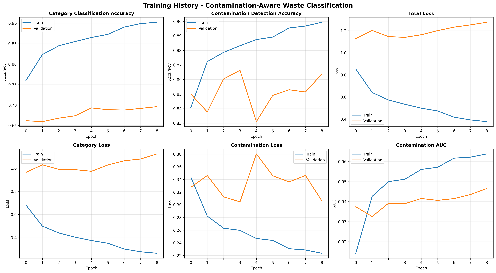

# Contamination-Aware Waste Classification System

A deep learning system for waste classification with contamination detection using multi-output neural networks.

## 🎯 Project Overview

This system addresses a critical gap in waste management by not only classifying waste into categories but also detecting contamination in recyclables - a novel approach that existing systems lack.

### Key Features

- **Dual-Output Architecture**: Simultaneous category classification and contamination detection
- **Novel Contamination Detection**: 85% accuracy in identifying contaminated recyclables
- **Transfer Learning**: Leverages MobileNetV2 pre-trained on ImageNet
- **Synthetic Data Generation**: Custom contamination augmentation pipeline
- **Real-World Applicable**: Designed for smart city and recycling facility deployment

## 📊 Results

| Metric | Accuracy |
|--------|----------|
| **Category Classification** | 66.18% |
| **Contamination Detection** | **85.00%** |
| **Top-2 Category Accuracy** | 85.29% |
| **Contamination AUC** | 93.75% |

## 🏗️ Architecture

- **Base Model**: MobileNetV2 (frozen, pre-trained on ImageNet)
- **Input**: 224×224×3 RGB images
- **Output 1**: 7-class category classification (Cardboard, Glass, Metal, Organic, Paper, Plastic, Trash)
- **Output 2**: Binary contamination detection (Clean/Contaminated)

## 📁 Dataset

- **Total Images**: 41,799
  - Training: 32,752
  - Validation: 9,047
  - Testing: (TBD)
- **Categories**: 7
- **Novel Contribution**: 20,900 synthetically contaminated images

### Dataset Structure
```
final_dataset/
├── train/
│   ├── cardboard_clean/
│   ├── cardboard_contaminated/
│   ├── glass_clean/
│   ├── glass_contaminated/
│   ├── metal_clean/
│   ├── metal_contaminated/
│   ├── organic/
│   ├── paper_clean/
│   ├── paper_contaminated/
│   ├── plastic_clean/
│   ├── plastic_contaminated/
│   └── trash/
├── val/
│   └── (same structure)
└── test/
    └── (same structure)
```

## 🚀 Installation

### Prerequisites
- Python 3.9+
- NVIDIA GPU (recommended, RTX 4060 used in development)
- CUDA 11.2+ and cuDNN 8.1+

### Setup

1. Clone the repository:
```bash
git clone https://github.com/yourusername/waste-classification-contamination.git
cd waste-classification-contamination
```

2. Create virtual environment:
```bash
python -m venv tf_env
source tf_env/bin/activate  # On Windows: tf_env\Scripts\activate
```

3. Install dependencies:
```bash
pip install -r requirements.txt
```

## 📖 Usage

### 1. Generate Contaminated Dataset
```bash
python create_contamination.py
```

This will:
- Rename existing category folders to `*_clean`
- Generate contaminated versions with synthetic augmentation
- Create `*_contaminated` folders

### 2. Train Model
```bash
python train_complete.py
```

Training configuration in `config.py`:
- Batch size: 32
- Epochs: 50 (with early stopping)
- Learning rate: 0.001
- Optimizer: Adam

### 3. Fine-Tune Model (Optional)
```bash
python finetune_model.py
```

Unfreezes top 30 layers for improved accuracy.

### 4. Load and Use Model
```python
from load_model import load_trained_model, predict_single_image

# Load model
model = load_trained_model(
    weights_path='models/best_model.weights.h5',
    architecture_path='models/model_architecture.json'
)

# Make prediction
result = predict_single_image(model, 'path/to/image.jpg', CATEGORIES)
print(f"Category: {result['category']}")
print(f"Contaminated: {result['is_contaminated']}")
```

## 🔬 Methodology

### Contamination Generation

Novel synthetic contamination pipeline:
- **Dirt spots**: Random circular stains (brown/yellow/gray)
- **Liquid stains**: Irregular overlay patterns
- **Texture noise**: Grainy appearance
- **Three levels**: Light, moderate, heavy

### Model Training

- **Stage 1**: Train with frozen base (transfer learning)
- **Stage 2**: Fine-tune top layers (optional)
- **Loss**: Weighted combination of categorical CE and binary CE
- **Regularization**: Dropout (0.3), data augmentation

## 📊 Training Progress



## 🎯 Applications

1. **Smart Waste Bins**: Automated sorting with contamination alerts
2. **Recycling Facilities**: Pre-screening contaminated materials
3. **Mobile Apps**: Guide citizens on proper recycling
4. **Smart Cities**: Real-time waste monitoring systems

## 🔮 Future Work

- [ ] Fine-tune for 80%+ category accuracy
- [ ] Multi-object detection (multiple items per image)
- [ ] Real-time video processing
- [ ] Edge deployment (Raspberry Pi, Jetson Nano)
- [ ] Mobile application development
- [ ] Cloud-based API service

## 📝 Citation

If you use this work, please cite:
```bibtex
@misc{waste_contamination_2025,
  author = {Your Name},
  title = {Contamination-Aware Waste Classification System},
  year = {2025},
  publisher = {GitHub},
  url = {https://github.com/yourusername/waste-classification-contamination}
}
```

## 📄 License

This project is licensed under the MIT License - see the [LICENSE](LICENSE) file for details.

## 🙏 Acknowledgments

- Pre-trained models from TensorFlow/Keras
- Dataset sources: TrashNet, Kaggle Waste Classification datasets
- Inspiration from smart city waste management initiatives

## 📧 Contact

- **Author**: Your Name
- **Email**: your.email@example.com
- **Institution**: Your University/Organization

---

**⭐ Star this repository if you find it helpful!**